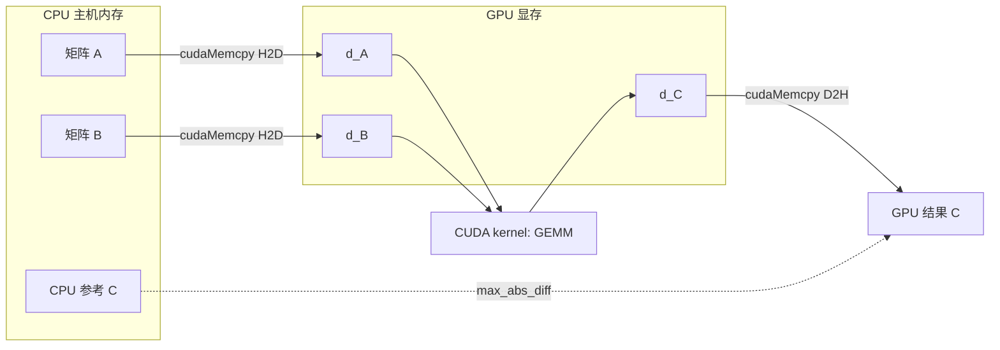

# Phase 01：GPU 上的矩阵乘法（GEMM）

背景、图、口头自检、习题。配合本目录 `gemm.cu` / `main.cu` 以及提供的 `benchmark.py`。

---

## 1. 这一阶段在学什么

把线性代数里的矩阵乘法 \(C = A \times B\) 搬到 GPU 上：学会**分配显存**、**在 CPU 与 GPU 之间拷贝数据**，再写两种 kernel：

- **朴素版（Naive）**：一个线程算 \(C\) 的一个元素，思路最直观，速度慢。
- **分块版（Tiled）**：数据进 **shared memory**，块内线程复用读入的 \(A\)、\(B\) 片段（常见高性能 GEMM 的起点）。

最后用 **CPU 上的 FP32 GEMM** 作参考，对一下误差。

---

## 2. 数据流（主机 → 设备）

---

## 3. 算法演进与工业界实现

在自己手写了基础的 Tiling 技巧后，我们不妨把目光放长远，看看真实的工业界是如何把 GEMM 优化到极致的。

从历史发展的角度来看，矩阵乘法的优化就是一部“与内存墙（Memory Wall）搏斗”的历史。
- **CPU 时代**：早期的矩阵乘法是简单的三层 `for` 循环，时间复杂度是 $O(N^3)$。后来发现瓶颈不在 CPU 算得慢，而在内存读得慢，于是诞生了基于**缓存分块（Cache Blocking）**的 BLAS 库（如 GotoBLAS），尽量让数据留在靠近计算单元的 L1/L2 缓存里。
- **GPU 时代**：GPU 拥有极高的计算吞吐量，但全局显存带宽（Global Memory Bandwidth）依然跟不上。如果不做优化，就会严重受限于内存读取。
- **Tiling 的必然性**：为了打破内存墙，CUDA 引入了速度极快的**共享内存（Shared Memory）**。我们在 `gemm_tiled_ker` 中做的，本质上就是用极小块的快速存储，换取成百上千次的重复全局内存读取。

但仅仅做到这一步还不够。在当今的深度学习框架中，手写 CUDA GEMM 很难超越 NVIDIA 官方闭源的 `cuBLAS`，因为后者在 SASS（汇编）级别对指令排布、寄存器复用做了登峰造极的优化。

为了让普通开发者也能触及硬件极限，NVIDIA 开源了 **CUTLASS** 库。它利用 C++ 模板元编程，将 GEMM 严格抽象为：Thread Block 级、Warp 级和 Thread 级的层次化计算。而近两年，OpenAI 支持的 **Triton** 语言更是实现了降维打击：开发者只需关注 Block 级别的逻辑，编译器会自动推导共享内存的分配和同步。目前 PyTorch 2.0 的 `torch.compile` 底层正是大量生成 Triton 代码。

---

## 4. 性能对比与剖析（Benchmark & Profiling）

为什么我们要费尽心思做 Tiling 甚至使用高级框架？纸上得来终觉浅，本目录下的 `benchmark.py` 用 Python/PyTorch 模拟了不同实现级别的性能差距。

如果你运行一下对比测试，会发现巨大的**性能鸿沟**：

1. **纯 Python 循环（等效于极度劣化版的 Naive）**：耗时极长，完全无法利用 GPU 并行计算。
2. **PyTorch 原生实现（底层调用 cuBLAS / CUTLASS）**：速度极快，在 A100 上可以逼近其理论峰值算力（例如 FP32 下达到接近 19.5 TFLOPS）。

**性能差距的根本原因**在于**计算访存比（Arithmetic Intensity）**：
- **Naive 实现是 Memory Bound（内存受限）**：为了计算 $C$ 的一个元素，我们需要从全局显存中读取一行 $A$ 和一列 $B$。算术单元大部分时间在“等数据”，带宽被死死卡住。
- **优化后的 cuBLAS/Triton 是 Compute Bound（计算受限）**：通过完美的 Tiling 甚至寄存器级的缓存，数据一拿进来就被反复咀嚼计算，彻底解放了算术单元。

---

## 5. 和本目录代码怎么对应

| 概念 | 在本 demo 里 |
|------|----------------|
| 朴素并行 | `gemm_naive_ker`：按行/列映射线程到输出矩阵元素 |
| 分块 + 共享内存 | `gemm_tiled_ker`：`__shared__` 缓冲区 + `__syncthreads()` |
| 错误检查 | `CUDA_CK`（见 `demos/common/cuda_check.cuh`） |
| CPU 参考 | `cpu_gemm_f32`（`demos/common/cpu_gemm.cpp`） |
| 性能基准 | `benchmark.py`：直观展示未经优化的循环与极致优化的 `torch.matmul` 之间的算力差异 |

---

## 6. 扩展阅读

1. **Volkov & Demmel (2008)**: *Benchmarking GPUs to tune dense linear algebra*  
   奠定了在 CUDA 上通过寄存器和共享内存优化矩阵乘法的基础。  
   论文链接：https://www2.eecs.berkeley.edu/Pubs/TechRpts/2008/EECS-2008-49.pdf
2. **NVIDIA 官方博客**：如何写出高性能的 CUDA Tiled GEMM  
   https://developer.nvidia.com/blog/how-to-write-high-performance-matrix-multiply-in-nvidia-cuda-tile/
3. **CUTLASS 开源库**：工业级高性能算子的 C++ 模板实现  
   https://github.com/NVIDIA/cutlass
4. **Triton 论文 (Philippe Tillet)**: *Triton: An Intermediate Language and Compiler for Tiled Neural Network Computations*  
   http://www.eecs.harvard.edu/~ptillet/triton.pdf

---

## 7. 用简单话讲清楚（自检）

口头或写 5 句：

1. 不用术语：为什么 GPU 算矩阵乘往往比「一个大 for 循环的 CPU」快？（提示：并行、带宽。）
2. 为什么 naive kernel 会「很费显存带宽」？
3. `__shared__` 和全局内存各是什么？为什么 tiling 能减少读全局内存的次数？
4. 为什么要用 `cudaDeviceSynchronize()` 再读回结果？
5. 若 GPU 结果和 CPU 差 `1e-3`，可能有哪些原因？（提示：非结合律、fast-math、累加顺序。）

讲给不懂 CUDA 的人听；卡壳处再回去补。

---

## 8. 自测题

**Q1.** `cudaMemcpyHostToDevice` 与 `cudaMemcpyDeviceToHost` 方向反了会怎样？  
**Q2.** `gemm_tiled_ker` 里两次 `__syncthreads()` 各自解决什么问题？  
**Q3.** 若 \(K\) 不是 tile 大小的整数倍，tiling 循环通常怎么处理边界？（结合你读过的资料回答。）  
**Q4.** 为什么对比 CPU 时常用 `max_abs_diff` 而不是只打印一两个元素？  
**Q5.** block 维度 `(16,16)` 与 grid 维度如何与矩阵大小 \(M,N\) 关联？

### 参考答案

1. 一般会拷贝错数据或崩溃；属于常见低级错误。  
2. 第一次：保证同一块 tile 的 `As`/`Bs` 写完再读；第二次：保证乘加阶段读完共享内存再加载下一轮 tile。  
3. 常见做法：越界位置填 0，或单独处理最后一轮不满 tile 的范围。  
4. 全局标量能覆盖所有元素的误差，避免「碰巧挑到对的元素」。  
5. `grid.x ≈ ceil(N/16)`，`grid.y ≈ ceil(M/16)`，每个 block 负责输出 tile 的一角。