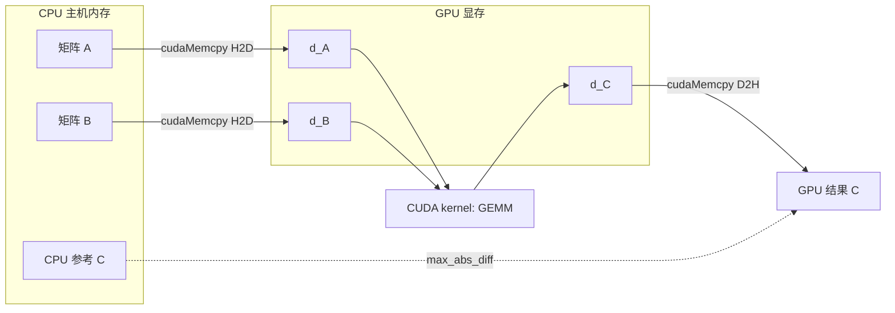

# Phase 01：GPU 上的矩阵乘法（GEMM）

背景、图、口头自检、习题。配合本目录 `gemm.cu` / `main.cu`。

---

## 1. 这一阶段在学什么

把线性代数里的矩阵乘法 \(C = A \times B\) 搬到 GPU 上：学会**分配显存**、**在 CPU 与 GPU 之间拷贝数据**，再写两种 kernel：

- **朴素版**：一个线程算 \(C\) 的一个元素，思路最直观，速度慢。
- **分块（tiling）版**：数据进 **shared memory**，块内线程复用读入的 \(A\)、\(B\) 片段（常见高性能 GEMM 的起点）。

最后用 **CPU 上的 FP32 GEMM** 作参考，对一下误差。

---

## 2. 数据流（主机 → 设备）

网上有不少 tiled GEMM 的示意图；扩展阅读里 NVIDIA 那篇带图。

---

## 3. 和本目录代码怎么对应

| 概念 | 在本 demo 里 |
|------|----------------|
| 朴素并行 | `gemm_naive_ker`：按行/列映射线程到输出矩阵元素 |
| 分块 + 共享内存 | `gemm_tiled_ker`：`__shared__` 缓冲区 + `__syncthreads()` |
| 错误检查 | `CUDA_CK`（见 `demos/common/cuda_check.cuh`） |
| CPU 参考 | `cpu_gemm_f32`（`demos/common/cpu_gemm.cpp`） |

---

## 4. 扩展阅读

1. NVIDIA：分块矩阵乘（CUDA tile）  
   https://developer.nvidia.com/blog/how-to-write-high-performance-matrix-multiply-in-nvidia-cuda-tile/
2. Seth Weidman：GEMM / tiling  
   https://www.sethweidman.com/blog/cuda_matmul.html
3. Stack Overflow：tile 与矩阵尺寸不整除时的边界  
   https://stackoverflow.com/questions/18815489/cuda-tiled-matrix-matrix-multiplication-with-shared-memory-and-matrix-size-whic/18856054

---

## 5. 用简单话讲清楚（自检）

可选（英文，步骤拆得细一点）：  
https://www.freecodecamp.org/news/how-to-understand-complex-coding-concepts-better-using-the-feynman-technique/

口头或写 5 句：

1. 不用术语：为什么 GPU 算矩阵乘往往比「一个大 for 循环的 CPU」快？（提示：并行、带宽。）
2. 为什么 naive kernel 会「很费显存带宽」？
3. `__shared__` 和全局内存各是什么？为什么 tiling 能减少读全局内存的次数？
4. 为什么要用 `cudaDeviceSynchronize()` 再读回结果？
5. 若 GPU 结果和 CPU 差 `1e-3`，可能有哪些原因？（提示：非结合律、fast-math、累加顺序。）

讲给不懂 CUDA 的人听；卡壳处再回去补。

---

## 6. 自测题

**Q1.** `cudaMemcpyHostToDevice` 与 `cudaMemcpyDeviceToHost` 方向反了会怎样？  
**Q2.** `gemm_tiled_ker` 里两次 `__syncthreads()` 各自解决什么问题？  
**Q3.** 若 \(K\) 不是 tile 大小的整数倍，tiling 循环通常怎么处理边界？（结合你读过的资料回答。）  
**Q4.** 为什么对比 CPU 时常用 `max_abs_diff` 而不是只打印一两个元素？  
**Q5.** block 维度 `(16,16)` 与 grid 维度如何与矩阵大小 \(M,N\) 关联？

### 参考答案（先自己做）

1. 一般会拷贝错数据或崩溃；属于常见低级错误。  
2. 第一次：保证同一块 tile 的 `As`/`Bs` 写完再读；第二次：保证乘加阶段读完共享内存再加载下一轮 tile。  
3. 常见做法：越界位置填 0，或单独处理最后一轮不满 tile 的范围。  
4. 全局标量能覆盖所有元素的误差，避免「碰巧挑到对的元素」。  
5. `grid.x ≈ ceil(N/16)`，`grid.y ≈ ceil(M/16)`，每个 block 负责输出 tile 的一角。
