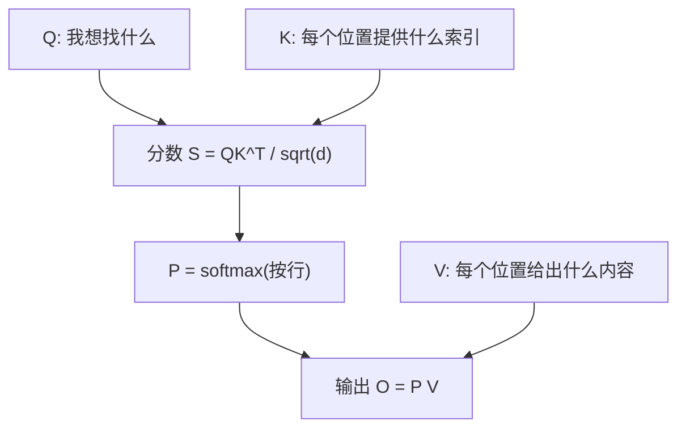

# Phase 02 学习卡片：Softmax、LayerNorm、Attention 与「梯度对不对」

本阶段有三个小可执行文件：`sm.cu`（softmax）、`ln.cu`（LayerNorm）、`attn.cu`（极简注意力）。核心思想是：**GPU 做 forward**，**CPU 上做数值梯度 / 解析梯度对照**。

---

## 1. 这一阶段在学什么

- **Softmax**：把一组任意实数变成「和为 1 的概率分布」，数值上要先减最大值防止指数爆炸。
- **LayerNorm**：对每个向量在**特征维**上做「减均值、除方差」，让训练更稳。
- **Scaled Dot-Product Attention**：用 \(Q,K,V\) 做「查询—键—值」的加权汇聚；你手里的 `attn.cu` 用**极小尺寸**把数学链条跑通。

同时接触 **gradcheck（梯度检查）** 的思想：用「微微扰动输入 → 看损失变化」的**数值梯度**，对照你推导或实现的**解析梯度**。

---

## 2. 一张图看懂 Attention（概念版）

> **「图文并茂」强烈推荐**：Jay Alammar 的《The Illustrated Transformer》是业界最出名的图解长文之一（英文，图很多）：  
> https://jalammar.github.io/illustrated-transformer/

---

## 3. 和本目录代码怎么对应

| 文件 | 你应抓住的主线 |
|------|----------------|
| `sm.cu` | row-wise softmax kernel；交叉熵损失的梯度为什么是 `p - one_hot` |
| `ln.cu` | 最后一维 normalize；损失取 `sum(y^2)` 是为了让梯度不退化（相对「对 y 求和」更合理） |
| `attn.cu` | \(2\times2\) 的极简 SDPA；CPU 反向与数值梯度对照 |

---

## 4. 扩展阅读

1. The Illustrated Transformer（图解 Transformer，强烈建议收藏）：  
   https://jalammar.github.io/illustrated-transformer/
2. Softmax 数值稳定（log-sum-exp 思路在各类教程里都会讲；可搜索 "log-sum-exp trick"）：  
   https://en.wikipedia.org/wiki/LogSumExp
3. LayerNorm 与 BatchNorm 的对比（概念向）：  
   https://arxiv.org/abs/1607.06450（原论文，偏数学）

---

## 5. 费曼学习法：请你讲给「只学过线性代数」的人听

1. Softmax 的输出有什么性质？为什么适合当作「注意力权重」？  
2. 为什么要除以 \(\sqrt{d}\)（scaled）？直觉上解决什么问题？  
3. LayerNorm 是对「哪一条轴」归一化？和 BatchNorm 有什么直觉差别？  
4. 数值梯度为什么要用「中心差分」 \(\frac{f(x+h)-f(x-h)}{2h}\)？  
5. 若 gradcheck 失败，你最先检查的三件事是什么？

---

## 6. 自测题

**Q1.** 对一行 logits 做 softmax 前，先减该行最大值，会不会改变 softmax 结果？证明或举反例。  
**Q2.** 注意力权重 \(P\) 的每一行和为多少？  
**Q3.** LayerNorm 里 \(\epsilon\) 的作用是什么？  
**Q4.** 为什么 `sm.cu` 用交叉熵损失来驱动 gradcheck，而不是 `sum(softmax)`？  
**Q5.** `attn.cu` 里 GPU forward 与 CPU forward 应对齐；若不一致，优先怀疑哪三类错误？

### 参考答案

1. 不会改变；分子分母同乘常数因子抵消。  
2. 为 1（概率分布）。  
3. 防止方差为 0 时除以 0，并改善数值条件。  
4. `sum(softmax)` 恒为常数，梯度为 0，无法检验 logits 的梯度。  
5. kernel 索引/boundary、softmax 数值稳定实现差异、读写顺序或同步缺失。
