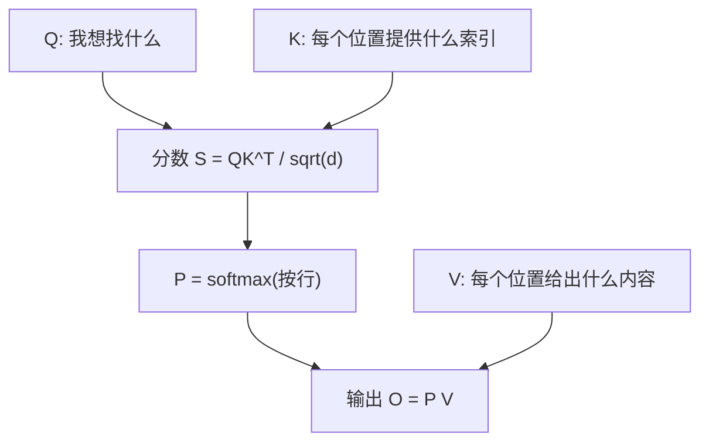

# Phase 02：Softmax、LayerNorm、Attention 与梯度检查

本阶段有三个小可执行文件：`sm.cu`（softmax）、`ln.cu`（LayerNorm）、`attn.cu`（极简注意力）。核心思想是：**GPU 做 forward**，**CPU 上做数值梯度 / 解析梯度对照**。

---

## 1. 这一阶段在学什么

- **Softmax**：把一组任意实数变成「和为 1 的概率分布」，数值上要先减最大值防止指数爆炸。
- **LayerNorm**：对每个向量在**特征维**上做「减均值、除方差」，让训练更稳。
- **Scaled Dot-Product Attention**：\(Q,K,V\) 加权汇聚；`attn.cu` 用小尺寸演示。

同时接触 **gradcheck（梯度检查）** 的思想：用「微微扰动输入 → 看损失变化」的**数值梯度**，对照你推导或实现的**解析梯度**。

---

## 2. Attention（概念）

---

## 3. 算法演进与工业界实现

本阶段的基础算子看似简单，但它们曾是阻碍大语言模型（LLM）向更长上下文、更大规模发展的“绊脚石”。现代框架通过一系列极其硬核的底层创新彻底重塑了它们。

- **Softmax 的提速**：
  传统的 Safe Softmax 为了数值稳定需要减去最大值，这就必须遍历数据三次（找最大值，算指数和，除以和）。频繁的显存读写成了绝对的带宽瓶颈。后来学者们提出了 **Online Softmax**，巧妙运用数学变换，只需遍历一次数据 (Single Pass) 就能同时求出局部最大值、局部指数和并正确缩放结果。这极大地缓解了内存墙，成为了 PyTorch 和 vLLM 的底层标准。
- **LayerNorm 的演变**：
  BatchNorm 在 CV 领域大放异彩，但在序列长度不一的 NLP 中水土不服。LayerNorm 的提出解决了独立维度的问题。后来为了追求极致性能，演进出了 **RMSNorm**，去掉了均值偏移（Mean-centering）计算，速度更快且稳定，目前是几乎所有现代开源大模型（LLaMA、DeepSeek 等）的标配。
- **Attention 的破局：从 FlashAttention 到 DeepSeek 的 MLA/DSA**：
  标准 Attention 的痛点在于计算产生的庞大 $N \times N$ 分数矩阵。当序列变长时，把这堆中间变量在 SRAM 与 HBM（全局显存）之间反复搬运是极其低效的。
  **FlashAttention** 及其后续版本通过精妙的分块（Tiling）结合上述的 Online Softmax 算法，将三步计算完全融合（Fusion）在 SRAM 中，彻底避免了 $N \times N$ 矩阵的写入，这就是大模型开启长上下文（Long Context）时代的基石。
  而在推理阶段，保存历史生成的 K 和 V (KV Cache) 又成了显存杀手。**DeepSeek V2/V3** 提出了 **MLA (Multi-Head Latent Attention)**，通过低秩联合压缩技术将 Key 和 Value 压缩成一个低维潜向量，推理时只需缓存极小的向量。**DeepSeek V3.2** 更进一步提出了 **DSA (DeepSeek Sparse Attention)**，引入动态滑动窗口，仅关注历史中最相关的 Token，将长上下文的时间复杂度从 $O(L^2)$ 降到了 $O(L \cdot k)$。

---

## 4. 性能对比与剖析（Benchmark & Profiling）

为什么我们一直强调要避免把 $O(N^2)$ 的中间矩阵写回全局显存？本目录下的 `benchmark.py` 将给出直观的答案。

通过运行对比脚本，你会看到在长序列（例如 $N=8192$）下的骇人差距：
1. **Naive Python**：纯 Python 循环，耗时可能是几个数量级的慢，因为完全没有向量化和 GPU 并行。
2. **PyTorch 未融合 Attention**：使用普通的张量乘积和自带的 softmax（即 $Q \times K^T$，后跟 Softmax，再乘 $V$）。你会在监控中发现这会消耗极为庞大的中间显存，并且速度受到带宽严重的制约。
3. **FlashAttention（PyTorch `scaled_dot_product_attention`）**：显存消耗几乎为零（除了最终结果），因为中间那个几百 MB 的得分矩阵只存活在 SRAM 中，算完即毁。执行时间也因此大幅缩短。

**核心差距归因**就在于**带宽灾难**。在未融合的实现中，算术单元的计算时间仅占一小部分，绝大多数时间 GPU 都在等待数据顺着狭窄的总线从 HBM 爬进 SRAM。FlashAttention 证明了一点：在 SRAM 里重算（Recomputation）某些部分，总体时间也远远快于老老实实去读写慢速显存。

---

## 5. 和本目录代码怎么对应

| 文件 | 对应 |
|------|----------------|
| `sm.cu` | row-wise softmax kernel；交叉熵损失的梯度为什么是 `p - one_hot` |
| `ln.cu` | 最后一维 normalize；损失取 `sum(y^2)` 是为了让梯度不退化（相对「对 y 求和」更合理） |
| `attn.cu` | \(2\times2\) 的极简 SDPA；CPU 反向与数值梯度对照 |
| `benchmark.py` | 直观展示 Unfused Attention 遭遇内存墙后，与 FlashAttention 在速度和显存上的断层差异 |

---

## 6. 扩展阅读

1. **Milakov et al. (2018)**: *Online normalizer calculation for softmax*  
   Online Softmax 的数学推导，单趟遍历的开端。
2. **Dao et al. (2022)**: *FlashAttention: Fast and Memory-Efficient Exact Attention with IO-Awareness*  
   打破 O(N^2) 内存墙的划时代论文。  
   https://arxiv.org/abs/2205.14135
3. **DeepSeek-V2**: *A Strong, Economical, and Efficient Mixture-of-Experts Language Model*  
   详述 MLA (KV Cache 压缩) 的技术报告。  
   https://arxiv.org/abs/2405.04434
4. **DeepSeek-V3.2**: *Pushing the Frontier of Open Large Language Models*  
   引入 DSA 解决长上下文计算复杂度的报告。  
   https://arxiv.org/abs/2512.02556
5. **Zhang & Sennrich (2019)**: *Root Mean Square Layer Normalization*  
   RMSNorm 的提出。  
   https://arxiv.org/abs/1910.07467

---

## 7. 讲给「只学过线性代数」的人听

1. Softmax 的输出有什么性质？为什么适合当作「注意力权重」？  
2. 为什么要除以 \(\sqrt{d}\)（scaled）？直觉上解决什么问题？  
3. LayerNorm 是对「哪一条轴」归一化？和 BatchNorm 有什么直觉差别？  
4. 数值梯度为什么要用「中心差分」 \(\frac{f(x+h)-f(x-h)}{2h}\)？  
5. 若 gradcheck 失败，你最先检查的三件事是什么？

---

## 8. 自测题

**Q1.** 对一行 logits 做 softmax 前，先减该行最大值，会不会改变 softmax 结果？证明或举反例。  
**Q2.** 注意力权重 \(P\) 的每一行和为多少？  
**Q3.** LayerNorm 里 \(\epsilon\) 的作用是什么？  
**Q4.** 为什么 `sm.cu` 用交叉熵损失来驱动 gradcheck，而不是 `sum(softmax)`？  
**Q5.** `attn.cu` 里 GPU forward 与 CPU forward 应对齐；若不一致，优先怀疑哪三类错误？

### 参考答案

1. 不会改变；分子分母同乘常数因子抵消。  
2. 为 1（概率分布）。  
3. 防止方差为 0 时除以 0，并改善数值条件。  
4. `sum(softmax)` 恒为常数，梯度为 0，无法检验 logits 的梯度。  
5. kernel 索引/boundary、softmax 数值稳定实现差异、读写顺序或同步缺失。