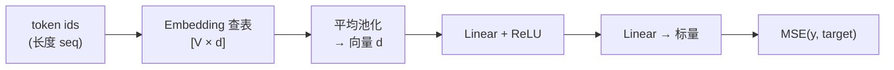

# Phase 03：从张量到小模型（Transformer 与 MoE）

本目录 demo：**CPU** 上 embedding → 线性/ReLU → 标量 → MSE。把可微算子串成模型，再对照大仓库里的 Transformer。

---

## 1. 这一阶段在学什么

- **Embedding**：把离散 token id 变成连续向量（查表）。
- **小前向网络**：矩阵乘 + 偏置 + 非线性，把「池化后的句子向量」映射到标量。
- **Xavier / Kaiming**：初始化别太大太小，减轻一开始梯度炸/没（本 demo 用简化缩放）。

---

## 2. 从 token 到标量输出

---

## 3. 算法演进与工业界实现

Transformer 自 2017 年提出以来，其内部的微结构和宏观架构发生了翻天覆地的演进。近两年来，DeepSeek 等开源巨头更是将 **MoE（混合专家模型）** 推向了极致。

从最初的架构来看，有很多演进都是被工程上的“训练崩溃”逼出来的：
- **从 Encoder-Decoder 到 Decoder-only**：最初的 Transformer (*Vaswani et al., 2017*) 用于机器翻译，包含双向编码器和自回归解码器。后来 *Radford 等人 (2018)* 的 GPT 证明了：只要把海量数据丢给纯 Decoder 进行 Next-Token Prediction，模型就能无监督地学到世间万物。
- **Norm 的位置颠倒（Post-Norm -> Pre-Norm -> DeepNorm）**：早期的 Transformer 把 LayerNorm 放在残差相加之后（Post-Norm），导致深层网络梯度极易消失。GPT-2 等直接改为了 **Pre-Norm**（在进入 Attention 或 FFN 前先做 Norm），极大提升了稳定性，这几乎是现在所有大语言模型的前提。
- **激活函数的进化（ReLU -> GeLU -> SwiGLU）**：FFN 层的非线性从生硬的 ReLU 到平滑的 GeLU，再进化到目前 LLaMA、DeepSeek 几乎全用的 **SwiGLU** (*Shazeer, 2020*)。它用门控机制（Gating）和 Swish 函数替代了传统的激活，虽然多了一次矩阵乘，但在相同算力下表现显著更好。
- **位置编码的飞跃（Absolute -> Relative -> RoPE）**：绝对位置编码在序列变长时会泛化失败。**RoPE（旋转位置编码，Su et al., 2021）** 巧妙地在复数空间中通过绝对位置的旋转实现了相对位置的表达，拥有极强的长度外推能力，如今已是工业界绝对标配。

更为震撼的是 **MoE（Mixture of Experts） 的极速普及与演进，构筑了 DeepSeek V2/V3 最深的护城河**：
传统的稀疏模型（如 Switch Transformer）每次只激活极少的大专家（比如 8 选 2），极易导致**路由坍塌（Routing Collapse）**——大部分 Token 只找固定的专家，其他的闲置；以及**知识坍塌**——通用知识无法被所有专家共享。
DeepSeekMoE (*Dai et al., 2024*) 做出了极具革命性的调整：
1. **细粒度专家划分（Fine-grained expert segmentation）**：把 1 个大专家切碎成 4 个小专家，增加路由的自由度。
2. **共享专家隔离（Shared expert isolation）**：单独划出几个“常驻代表”专家来处理标点、停用词等通用常识，剩下的专门去精通特定领域。
3. **无辅助损失负载均衡**：传统 MoE 为了逼着 token 均匀分发，会加上一个惩罚性 Loss。但这会“污染”模型的正常梯度。DeepSeek V3 引入了 **Auxiliary-Loss-Free Load Balancing**，通过动态调整 Bias 的方式实现了极低损耗的负载均衡。

---

## 4. 性能对比与剖析（Benchmark & Profiling）

为什么我们在处理 MoE 路由时，不能用看似最直观的 Python `if-else` 分支控制？请运行本目录下的 `benchmark.py`。

在基准测试中，你会发现一个很有意思的现象：
1. **串行路由（Python 循环 / 类似 If-Else 分支）**：如果你的代码是一个个检查 Token “你要去哪个专家，你去一号，你去二号”，速度极其缓慢。
2. **聚集与分散（Gather & Scatter / 批处理化路由）**：如果我们先把要去相同专家的 Token 在内存里聚拢（Gather），然后一次性扔给专家的矩阵乘算子，最后再把算完的结果按原位散开（Scatter），即使多了几步内存搬运，速度也远超分支预测。

**性能鸿沟的原因在于 GPU 最底层的 Warp Divergence（线程束分歧）**：
GPU 是并行怪物，但它的基本调度单位是 Warp（32 个线程同步执行同一条指令）。如果你在内核里用 `if-else` 把同一个 Warp 里的 32 个 Token 发送到不同的专家，GPU 就会出现**分歧（Divergence）**——它无法同时跑不同专家的代码，只能先把去专家 A 的线程跑完（其他挂起），再跑专家 B，并行计算彻底退化为串行的累加。

这就是为什么工业级的底层 CUDA 算子（乃至 PyTorch / Triton 层面）在实现 MoE 时，永远会先进行一次高效的**基于分桶（Bucket）的排序（Sorting）或 Gather 预处理**，然后再调用 Batched GEMM。因为“连续化内存以保住算术利用率”远比“省掉几步排序操作”重要得多。

---

## 5. 和本目录代码怎么对应

- `model.hpp` / `model.cpp`：`TinyPoetryModel` 的张量都用 `std::vector<float>` 表示，便于阅读。
- `main.cpp`：打印 `loss`、`emb` 的均值方差，粗看是否异常。
- `benchmark.py`：直观展示 MoE 路由中，Warp 分歧模拟实现与极致批处理化的性能差距。

---

## 6. 扩展阅读

1. **Dai et al. (2024)**: *DeepSeekMoE: Towards Ultimate Expert Specialization in Mixture-of-Experts Language Models*  
   细粒度专家划分与共享专家隔离的提出。  
   https://arxiv.org/abs/2401.06066
2. **Shazeer (2020)**: *GLU Variants Improve Transformer*  
   提出了 LLaMA 等正在广泛采用的 SwiGLU。  
   https://arxiv.org/abs/2002.05202
3. **Su et al. (2021)**: *RoFormer: Enhanced Transformer with Rotary Position Embedding*  
   旋转位置编码（RoPE）。  
   https://arxiv.org/abs/2104.09864
4. **Illustrated Transformer**  
   https://jalammar.github.io/illustrated-transformer/

---

## 7. 用「查表」解释 Embedding

不用公式，回答：

1. Embedding 和「one-hot 再乘一个大矩阵」为什么等价？  
2. 为什么要对一整段 token 做池化（本 demo 用平均）？真实 Transformer 用什么替代它？  
3. ReLU 在 forward 里做了什么「硬选择」？对梯度有什么影响？  
4. 若 `loss` 变成 `NaN`，你会按什么顺序排查？  

---

## 8. 自测题

**Q1.** 若 `vocab=64` 但输入 id 出现 `100`，本 demo 会怎样？（应如何避免？）  
**Q2.** MSE 对预测值 \(y\) 的导数是什么？  
**Q3.** Xavier 缩放与「fan-in、fan_out」是什么关系（一句话）？  
**Q4.** 为什么真实 LLM 几乎不会只用 mean pooling 来表示整句？  
**Q5.** 把 `d_model` 调大，forward 计算量大约按什么比例增长（量级即可）？

### 参考答案

1. 越界读写/未定义行为；应 `clamp` id 或保证数据合法。  
2. `2(y - t)`（对单个样本、单输出）。  
3. 方差缩放与输入/输出扇入扇出有关，让信号强度在层间更均衡。  
4. 需要保留序列信息与位置关系，通常用注意力与位置编码。  
5. 主要矩阵乘涉及 \(d^2\) 量级，约随 \(d^2\) 上升。