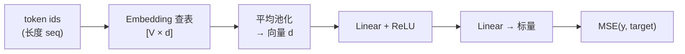

# Phase 03：从张量到小模型

本目录 demo：**CPU** 上 embedding → 线性/ReLU → 标量 → MSE。把可微算子串成模型，再对照大仓库里的 Transformer。

---

## 1. 这一阶段在学什么

- **Embedding**：把离散 token id 变成连续向量（查表）。
- **小前向网络**：矩阵乘 + 偏置 + 非线性，把「池化后的句子向量」映射到标量。
- **Xavier / Kaiming**：初始化别太大太小，减轻一开始梯度炸/没（本 demo 用简化缩放）。

---

## 2. 从 token 到标量输出

对照 embedding / 位置信息可从 Illustrated Transformer 里相关小节读起：  
https://jalammar.github.io/illustrated-transformer/

---

## 3. 和本目录代码怎么对应

- `model.hpp` / `model.cpp`：`TinyPoetryModel` 的张量都用 `std::vector<float>` 表示，便于阅读。
- `main.cpp`：打印 `loss`、`emb` 的均值方差，粗看是否异常。

---

## 4. 扩展阅读

1. Illustrated Transformer  
   https://jalammar.github.io/illustrated-transformer/
2. Xavier 初始化（Glorot & Bengio）  
   http://proceedings.mlr.press/v9/glorot10a/glorot10a.pdf
3. Transformer 从零搭（Medium，英文）  
   https://medium.com/@ibnashraf110/building-a-transformer-from-scratch-a-complete-beginners-g-be2a1fd17968

---

## 5. 用「查表」解释 Embedding

不用公式，回答：

1. Embedding 和「one-hot 再乘一个大矩阵」为什么等价？  
2. 为什么要对一整段 token 做池化（本 demo 用平均）？真实 Transformer 用什么替代它？  
3. ReLU 在 forward 里做了什么「硬选择」？对梯度有什么影响？  
4. 若 `loss` 变成 `NaN`，你会按什么顺序排查？  

---

## 6. 自测题

**Q1.** 若 `vocab=64` 但输入 id 出现 `100`，本 demo 会怎样？（应如何避免？）  
**Q2.** MSE 对预测值 \(y\) 的导数是什么？  
**Q3.** Xavier 缩放与「fan-in、fan_out」是什么关系（一句话）？  
**Q4.** 为什么真实 LLM 几乎不会只用 mean pooling 来表示整句？  
**Q5.** 把 `d_model` 调大，forward 计算量大约按什么比例增长（量级即可）？

### 参考答案

1. 越界读写/未定义行为；应 `clamp` id 或保证数据合法。  
2. `2(y - t)`（对单个样本、单输出）。  
3. 方差缩放与输入/输出扇入扇出有关，让信号强度在层间更均衡。  
4. 需要保留序列信息与位置关系，通常用注意力与位置编码。  
5. 主要矩阵乘涉及 \(d^2\) 量级，约随 \(d^2\) 上升。
