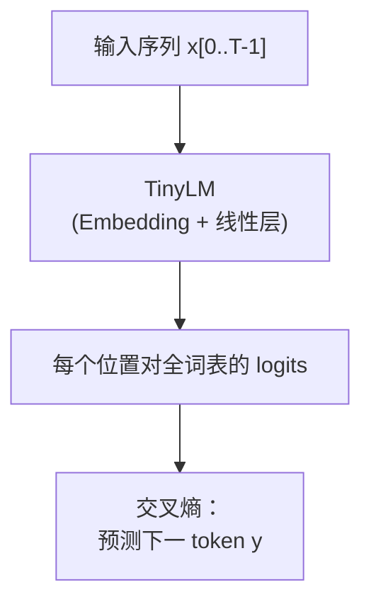

# Phase 04：数据、Tokenizer、训练与生成

读文本 → 字符词表 → 滑窗 batch → **SGD / AdamW** 训小 LM → **贪心 / 温度**生成。

---

## 1. 这一阶段在学什么

- **Tokenizer（字符级）**：把字符串映射成整数序列；词表小、实现简单，适合先理解「token 是什么」。
- **自回归下一词预测**：用当前上下文预测下一个 token；训练时目标右移一位（`dataset` 里的 `x` 与 `y`）。
- **优化器**：SGD；Adam（动量 + 二阶矩）。本 demo 写法简化，不等价 PyTorch 实现，只看趋势。
- **生成**：贪心 = 每步取 argmax；温度 = 把 logits 缩放后再 softmax，控制「更随机还是更确定」。

---

## 2. 自回归训练在优化什么

tokens / transformer 入门（英文）：  
https://tutorialq.com/ai/machine-learning/how-llms-work

---

## 3. 和本目录代码怎么对应

| 文件 | 作用 |
|------|------|
| `fixture.txt` | 极小语料样本 |
| `tok.cpp` | 字符词表与编解码 |
| `dataset.cpp` | 滑窗 batch |
| `micro_lm.cpp` | 前向 + 一步反向（手写梯度） |
| `train.cpp` | 两种优化器训练日志 |
| `gen.cpp` | 贪心 / 温度采样 |
| `main.cpp` | 串联训练与生成 |

---

## 4. 扩展阅读

1. How LLMs Work  
   https://tutorialq.com/ai/machine-learning/how-llms-work
2. Illustrated Transformer  
   https://jalammar.github.io/illustrated-transformer/
3. Adam  
   https://arxiv.org/abs/1412.6980

---

## 5. 讲清楚「为什么要右移一位」

回答：

1. 为什么 `y[t]` 通常等于 `x[t+1]`？  
2. 交叉熵损失在「分类」问题里扮演什么角色？  
3. 贪心解码一定比温度采样「更好」吗？在什么任务里贪心反而糟糕？  
4. 字符级 tokenizer 的主要缺点是什么？  

---

## 6. 自测题

**Q1.** 若语料极短导致某个 batch 取不到合法窗口，训练循环应如何处理？  
**Q2.** 温度 \(T \to 0^+\) 时，softmax(logits / T) 的极限行为是什么？  
**Q3.** Adam 里的 \(\epsilon\) 通常为什么取很小（如 `1e-8`）？  
**Q4.** 为什么本 demo 的「AdamW-ish」对 `bo` 仍用简单 SGD 更新？（从工程取舍角度回答即可）  
**Q5.** 字符级词表遇到罕见字时，真实系统常用什么办法缓解？（提示：子词/BPE）

### 参考答案

1. 跳过该 batch 或减小 `T` / 换更大数据。  
2. 退化为 argmax 的 one-hot（极限意义下「最尖锐」的分布）。  
3. 防止除以 0，并稳定根号项。  
4. 教学代码简化；全参数 AdamW 需要更多状态张量。  
5. BPE/WordPiece 等子词方法，或字节级 BPE。
