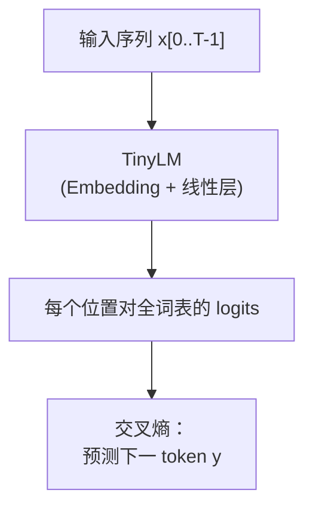

# Phase 04：数据、Tokenizer、训练与生成

读文本 → 字符词表 → 滑窗 batch → **SGD / AdamW** 训小 LM → **贪心 / 温度**生成。

---

## 1. 这一阶段在学什么

- **Tokenizer（字符级）**：把字符串映射成整数序列；词表小、实现简单，适合先理解「token 是什么」。
- **自回归下一词预测**：用当前上下文预测下一个 token；训练时目标右移一位（`dataset` 里的 `x` 与 `y`）。
- **优化器**：SGD；Adam（动量 + 二阶矩）。本 demo 写法简化，不等价 PyTorch 实现，只看趋势。
- **生成**：贪心 = 每步取 argmax；温度 = 把 logits 缩放后再 softmax，控制「更随机还是更确定」。

---

## 2. 自回归训练在优化什么

---

## 3. 算法演进与工业界实现

语言模型的训练和生成早已超越了简单的循环预测。在过去几年里，尤其是在 DeepSeek 等顶尖开源模型的推动下，各个环节都迎来了工业级的重构。

- **分词器（Tokenizer）的演进**：
  - **Word Level（词级别）**：容易产生无数的未登录词（OOV），词表极其庞大。
  - **Char Level（字符级别，本 Demo 采用）**：不会有 OOV，但序列变得极长，Transformer 处理起来效率极低。
  - **BPE (Byte Pair Encoding)** (*Sennrich et al., 2015*)：寻找文本中最高频出现的字节对进行合并。既控制了词表大小（通常 32K~128K），又把长单词拆分成了有意义的子词（Subwords）。这也是目前 OpenAI (Tiktoken)、LLaMA (SentencePiece) 的标配。
- **优化器（Optimizer）演进**：
  - **SGD** -> **Adam** (*Kingma & Ba, 2014*)：引入动量和梯度二阶矩，自适应调整学习率。
  - **AdamW** (*Loshchilov & Hutter, 2017*)：修复了在 Adam 中直接使用 L2 正则化失效的问题，将权重衰减（Weight Decay）从梯度更新中解耦出来，这对于训练大语言模型防止过拟合至关重要。
- **推理系统与生成机制演进**：
  - **传统 Batching**：由于每条句子的生成长度不同，把多个请求打包成一个 Batch 时，必须等最长的句子生成完，这就造成了极大的算力浪费。
  - **Continuous Batching** (Orca)：一旦某个请求生成完（遇到 EOS），立即把它剔除并塞入新请求，提高利用率。
  - **vLLM PagedAttention** (*Kwon et al., 2023*)：借用了操作系统中的虚拟内存“分页”思想，把极其消耗显存的 KV Cache 切割成不连续的内存页进行管理，彻底解决了显存碎片化问题，成为了现代大模型推理引擎的奠基石。
- **强化学习与对齐革命（DeepSeek R1/Math 核心突破）**：
  - **PPO (Proximal Policy Optimization)**：长期以来统治 RLHF（基于人类反馈的强化学习）的算法。但它需要同时在显存里塞下 4 个巨大的模型（Actor, Critic, Reference, Reward），对显存极其不友好。
  - **GRPO (Group Relative Policy Optimization)**：DeepSeek R1 和 Math 提出。直接抛弃了庞大的 Critic 模型，而是通过对同一道题生成多个候选答案，并在组内计算相对优势（Group Relative Advantage）。这使得训练显存暴降了近 50%，并且通过纯粹的 RL 激发了模型“顿悟”的强大逻辑推理能力（如 DeepSeek-R1-Zero）。

---

## 4. 性能对比与剖析（Benchmark & Profiling）

为什么在生产环境中，你绝不会用一个基础的 `for` 循环来做 Token 生成？我们来看看生成机制里的速度差距。

### 推理系统性能打台
你可以运行本目录下的 `benchmark.py`，感受一下**全量重算 Attention** 与**使用 KV Cache 增量解码**的鸿沟：
1. **Naive Loop (每次重新计算全部 Context)**：为了生成第 1001 个词，它会把前 1000 个词从头到尾通过 Attention 再算一遍。时间复杂度是 $O(N^3)$。
2. **KV Cache (增量解码)**：保存了历史上所有 Token 的 Key 和 Value，每一步只计算新生成的那一个 Token 的 Attention。时间复杂度降回 $O(N^2)$。这也是工业界生成系统的基本盘。

### 并发与碎片化（Fragmentation）的噩梦
在原生的 Python 列表管理 KV Cache 时，如果系统预先分配了 2048 长度的连续内存，但模型只生成了 10 个 Token 就结束了，剩下的 2038 个位置全部变成了“内部碎片”被浪费。而在大并发下，由于内存不连续，还会产生大量“外部碎片”。
当显存被碎片塞满时，即使 GPU 计算能力充足，也无法接纳新的用户请求（并发数卡死）。这就是为什么像 **vLLM 的 PagedAttention** 这样消除碎片的机制具有划时代意义的原因。

---

## 5. 和本目录代码怎么对应

| 文件 | 作用 |
|------|------|
| `fixture.txt` | 极小语料样本 |
| `tok.cpp` | 字符词表与编解码 |
| `dataset.cpp` | 滑窗 batch |
| `micro_lm.cpp` | 前向 + 一步反向（手写梯度） |
| `train.cpp` | 两种优化器训练日志 |
| `gen.cpp` | 贪心 / 温度采样 |
| `main.cpp` | 串联训练与生成 |
| `benchmark.py` | 展示全量重算 Attention 与 KV Cache 增量解码的生成速度差异 |

---

## 6. 扩展阅读

1. **Sennrich et al. (2015)**: *Neural Machine Translation of Rare Words with Subword Units*  
   BPE 分词器的经典出处。  
   https://arxiv.org/abs/1508.07909
2. **Loshchilov & Hutter (2017)**: *Decoupled Weight Decay Regularization*  
   AdamW 优化器的提出，解决了 L2 正则化的耦合问题。  
   https://arxiv.org/abs/1711.05101
3. **vLLM PagedAttention** (打破并发瓶颈的里程碑)  
   https://arxiv.org/abs/2309.06180
4. **DeepSeekMath (提出 GRPO，重塑强化学习对齐)**  
   https://arxiv.org/abs/2402.03300

---

## 7. 讲清楚「为什么要右移一位」

回答：

1. 为什么 `y[t]` 通常等于 `x[t+1]`？  
2. 交叉熵损失在「分类」问题里扮演什么角色？  
3. 贪心解码一定比温度采样「更好」吗？在什么任务里贪心反而糟糕？  
4. 字符级 tokenizer 的主要缺点是什么？  

---

## 8. 自测题

**Q1.** 若语料极短导致某个 batch 取不到合法窗口，训练循环应如何处理？  
**Q2.** 温度 \(T \to 0^+\) 时，softmax(logits / T) 的极限行为是什么？  
**Q3.** Adam 里的 \(\epsilon\) 通常为什么取很小（如 `1e-8`）？  
**Q4.** 为什么本 demo 的「AdamW-ish」对 `bo` 仍用简单 SGD 更新？（从工程取舍角度回答即可）  
**Q5.** 字符级词表遇到罕见字时，真实系统常用什么办法缓解？（提示：子词/BPE）

### 参考答案

1. 跳过该 batch 或减小 `T` / 换更大数据。  
2. 退化为 argmax 的 one-hot（极限意义下「最尖锐」的分布）。  
3. 防止除以 0，并稳定根号项。  
4. 教学代码简化；全参数 AdamW 需要更多状态张量。  
5. BPE/WordPiece 等子词方法，或字节级 BPE。