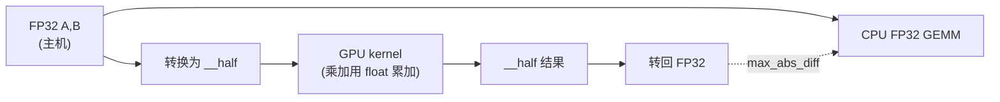

# Phase 05：FP16 混合精度与系统级极限优化

本阶段我们用 **FP16 存矩阵、FP32 累加** 的朴素 GEMM，对比 **FP32 CPU**。位宽低 → 省带宽/显存，误差阈值通常要比 FP32 宽。

---

## 1. 这一阶段在学什么

- **`__half` 与转换**：`__float2half` / `__half2float` 是 CPU/GPU 间与计算中最常用的桥梁之一。
- **混合精度**：常见写法是半精度存取、单精度累加，折中速度与误差。
- **误差来源**：舍入、累加顺序、fast-math 等，会让你更理解「为什么阈值不能照搬 FP32」。

---

## 2. FP32 参考 vs FP16 kernel



---

## 3. 算法演进与工业界实现

大模型的规模越来越庞大，标准 FP32 (单精度) 早已无法满足训练和推理对显存和算力的需求。为了容纳万亿参数，硬件和系统在最底层上演了极致的“微操”。

- **精度演进（Precision Scaling）**：
  - **FP32 -> FP16** (*Micikevicius et al., 2017*)：NVIDIA 提出了**混合精度训练（Mixed Precision Training）**。前向和反向传播使用 FP16 以提速并节省显存，但维护一个 FP32 的 Master Weights 用于优化器更新。因为 FP16 表示范围太小（最大 65504），为防止梯度下溢，引入了 **Loss Scaling** 技术。
  - **BF16 (Brain Floating Point)**：由 Google TPU 引入，后来被 NVIDIA Ampere 架构全面支持。相比 FP16，BF16 牺牲了尾数（精度），但保留了和 FP32 完全一样的指数位（表示范围）。这意味着训练 BF16 模型几乎不需要搞烦人的 Loss Scaling，绝不溢出，这也是目前开源大模型预训练的绝对主流。
  - **FP8 与极限训练（DeepSeek V3 核心突破）**：**DeepSeek V3 率先证明了在极大规模（671B）下完全使用 FP8 混合精度训练的可行性**。FP8 只有 8 个 bit，进一步把显存占用和通信带宽砍半。DeepSeek 通过细粒度的动态量化（Fine-grained Quantization）框架，成功稳住了 FP8 训练，这是他们能以极低成本训出顶尖模型的最硬核底座。
- **硬件与极限系统优化**：
  - **Volta 架构引入 Tensor Cores**：传统的 CUDA Core 只能做标量乘加，而 Tensor Core 是专门为 $4 \times 4$ 矩阵乘法设计的超大硬件计算单元，能在一整个 Warp (32 个线程) 内极速完成矩阵乘加。
  - **CUTLASS 释放硬件算力**：高级的 C++ 库，通过把矩阵分块，调用最底层的 `mma.sync` (Matrix Multiply-Accumulate) 等内联汇编指令，真正激活并压榨 Tensor Core。
  - **绕过 CUDA 的汇编级优化（DeepSeek 核心突破）**：为了解决 GPU 集群通信时的显存读取瓶颈，DeepSeek 在其开源的 **DeepEP** 通信库中，直接抛弃了高级的 CUDA C API，转而手写 NVIDIA 最底层的中间汇编语言 **PTX**。例如使用了 `ld.global.nc.L1::no_allocate.L2::256B` 指令。这条指令强制 GPU 在读取全局内存时**不分配 L1 缓存**（保留原有的高价值计算缓存），并使用非一致性缓存（Non-Coherent），从而极限压榨了 GPU 的内存带宽。这就是前段时间全网热议的“DeepSeek 绕开 CUDA 垄断”的底层真相。

---

## 4. 性能对比与剖析（Benchmark & Profiling）

降低精度和使用底层汇编究竟能带来多大的收益？你可以运行本目录下的 `benchmark.py` 来看看现代 GPU 上不同精度的算力断层。

### 硬件级指令性能打台（以 NVIDIA H100 理论峰值为例）
| 计算单元 / 精度 | 峰值算力 (TFLOPS) | 显存带宽消耗倍率 | 瓶颈与适用场景 |
|---------------|-----------------|----------------|--------------|
| **CUDA Core (FP32 标量计算)** | 67 TFLOPS | 4x | 传统科学计算，高精度要求。 |
| **Tensor Core (FP16 / BF16)** | **989 TFLOPS (14倍提升)** | 2x | **当前大模型训练与推理的基石**。需要调用特定的 `mma` 汇编指令才能激活。 |
| **Tensor Core (FP8)** | **1979 TFLOPS (近30倍提升)** | 1x (极低) | **DeepSeek V3 的终极杀器**。带宽和计算能力全方位翻倍，但极容易溢出，需要顶尖的量化对齐工程。 |

### 核心代码分析：为什么普通的 CUDA 编译器不行？
在普通的 C++ CUDA 代码中写 `A * B + C`，编译器（nvcc）默认会把它翻译成使用普通的 CUDA Core 标量指令（如 `FFMA`）。
要想激活上述表格里成十倍百倍的算力，你必须明确告诉 GPU：“这是一块矩阵，请用专门的矩阵乘法器（Tensor Core）去算”。
在最底层，这对应着 PTX 中的一条汇编指令：
```ptx
mma.sync.aligned.m16n8k16.row.col.f32.f16.f16.f32 
```
这就是为什么单纯用 `float` 或 `__half` 声明变量是不够的，你需要 **CUTLASS** 或者 **Triton** —— 它们在底层帮你把大矩阵切碎，并精确地映射到了这些超高速的硬件汇编指令上。而像 DeepSeek 这种极限玩家，甚至会为了保护 L1 Cache，自己重写读取数据的 PTX 汇编，实现了对手写 CUDA 的降维打击。

---

## 5. 和本目录代码怎么对应

| 文件 | 作用 |
|------|------|
| `fp16_gemm.cu` | `__half` 输入、`float acc`、`__half` 写回。 |
| `main.cu` | 与 `cpu_gemm_f32` 对比（输入先把 half 变回 float 喂给 CPU，保持可比性）。 |
| `benchmark.py` | 利用 PyTorch 直观展示在 GPU 上 FP32 与触发 Tensor Core 的 FP16 带来的算力鸿沟。 |

---

## 6. 扩展阅读

1. **Micikevicius et al. (2017)**: *Mixed Precision Training*  
   混合精度训练的开山之作。  
   https://arxiv.org/abs/1710.03740
2. **DeepSeek-V3 Technical Report**  
   展示如何通过细粒度量化驾驭极易溢出的 FP8 混合精度，极致降低万卡训练成本。  
   https://arxiv.org/abs/2412.19437
3. **NVIDIA Tensor Cores 深度解析**  
   https://developer.nvidia.com/tensor-cores
4. **CUTLASS (高性能 CUDA 模板库)**  
   压榨 Tensor Core 的必学底层库。  
   https://github.com/NVIDIA/cutlass

---

## 7. 用「有效数字」解释 FP16

回答：

1. FP16 比 FP32 少哪些「比特」？直觉上会影响什么？  
2. 为什么累加经常用 FP32？  
3. 若误差阈值设得像 FP32 一样严格，会发生什么？  
4. Tensor Core 路线与「手写 naive FP16」差在哪里（一句话）？  

---

## 8. 自测题

**Q1.** `__half` 在 host 端 `std::vector<__half>` 里布局与对齐需要注意什么（概念层面）？  
**Q2.** 本 demo 的误差对比路径是：half→float→CPU GEMM；另一种常见路径是全程 FP16 累加，它们差别主要在哪里？  
**Q3.** `-use_fast_math` 可能如何影响对比阈值？  
**Q4.** 若矩阵规模极大，FP16 相对 FP32 的主要收益来自算力还是带宽（通常场景）？  
**Q5.** 什么时候不应该用 FP16（举两类任务/模块）？

### 参考答案

1. 半精度对齐/可移植性细节更多；需要关注编译器与平台支持。  
2. 累加是误差主要来源；FP32 累加更稳。  
3. demo 很容易失败；需要放宽阈值或关闭激进优化再比。  
4. Tensor Core 使用专用硬件指令与 tiling/warp 协作；手写 naive 主要体现语义与数值现象。  
5. 需要极高数值精度（某些科学计算）、或对极小梯度敏感的训练阶段等。