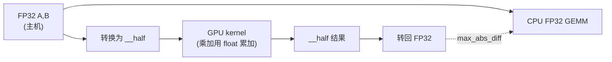

# Phase 05 学习卡片：FP16 与「更快更省显存」的入门

本目录 demo 用 **FP16 存矩阵、FP32 累加** 的朴素 GEMM，对照 **FP32 CPU 参考**。你会直观看到：更低位宽 → 更省带宽/存储，但数值误差容忍度要放宽。

---

## 1. 这一阶段在学什么

- **`__half` 与转换**：`__float2half` / `__half2float` 是 CPU/GPU 间与计算中最常用的桥梁之一。
- **混合精度直觉**：很多高性能 kernel 会「半精度存取、单精度累加」，在精度与速度之间折中。
- **误差来源**：舍入、累加顺序、fast-math 等，会让你更理解「为什么阈值不能照搬 FP32」。

---

## 2. 一张图：FP32 参考 vs FP16 kernel

---

## 3. 和本目录代码怎么对应

- `fp16_gemm.cu`：`__half` 输入、`float acc`、`__half` 写回。
- `main.cu`：与 `cpu_gemm_f32` 对比（输入先把 half 变回 float 喂给 CPU，保持可比性）。

---

## 4. 扩展阅读（官方文档优先）

1. CUDA Math API：Half Precision Intrinsics（官方）：  
   https://docs.nvidia.com/cuda/cuda-math-api/group__CUDA__MATH__INTRINSIC__HALF.html
2. Half 精度转换与数据移动（官方小节）：  
   https://docs.nvidia.com/cuda/cuda-math-api/cuda_math_api/group__CUDA__MATH____HALF__MISC.html
3. 一篇偏入门的 FP16 CUDA 写作介绍（Medium，英文）：  
   https://ion-thruster.medium.com/an-introduction-to-writing-fp16-code-for-nvidias-gpus-da8ac000c17f

---

## 5. 费曼学习法：用「有效数字」解释 FP16

请你回答：

1. FP16 比 FP32 少哪些「比特」？直觉上会影响什么？  
2. 为什么累加经常用 FP32？  
3. 若误差阈值设得像 FP32 一样严格，会发生什么？  
4. Tensor Core 路线与「手写 naive FP16」差在哪里（一句话）？  

---

## 6. 自测题

**Q1.** `__half` 在 host 端 `std::vector<__half>` 里布局与对齐需要注意什么（概念层面）？  
**Q2.** 本 demo 的误差对比路径是：half→float→CPU GEMM；另一种常见路径是全程 FP16 累加，它们差别主要在哪里？  
**Q3.** `-use_fast_math` 可能如何影响对比阈值？  
**Q4.** 若矩阵规模极大，FP16 相对 FP32 的主要收益来自算力还是带宽（通常场景）？  
**Q5.** 什么时候不应该用 FP16（举两类任务/模块）？

### 参考答案

1. 半精度对齐/可移植性细节更多；需要关注编译器与平台支持。  
2. 累加是误差主要来源；FP32 累加更稳。  
3. demo 很容易失败；需要放宽阈值或关闭激进优化再比。  
4. Tensor Core 使用专用硬件指令与 tiling/warp 协作；手写 naive 主要体现语义与数值现象。  
5. 需要极高数值精度（某些科学计算）、或对极小梯度敏感的训练阶段等。
